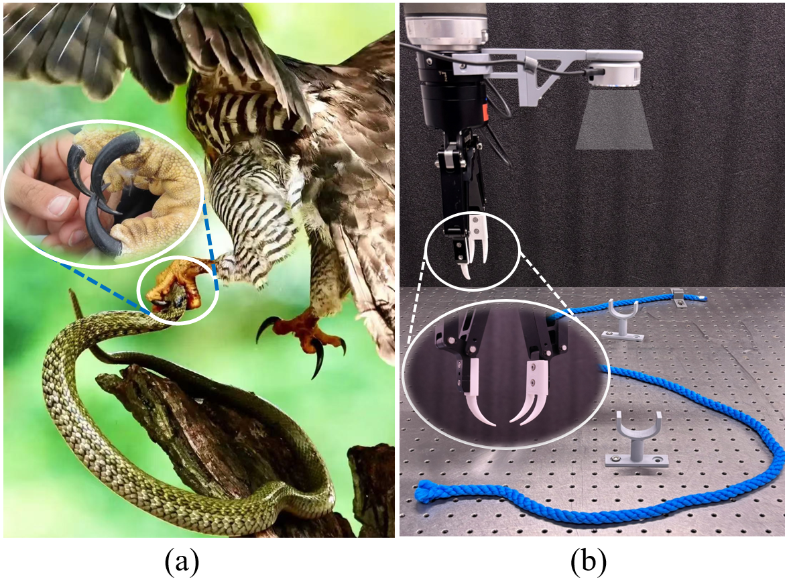
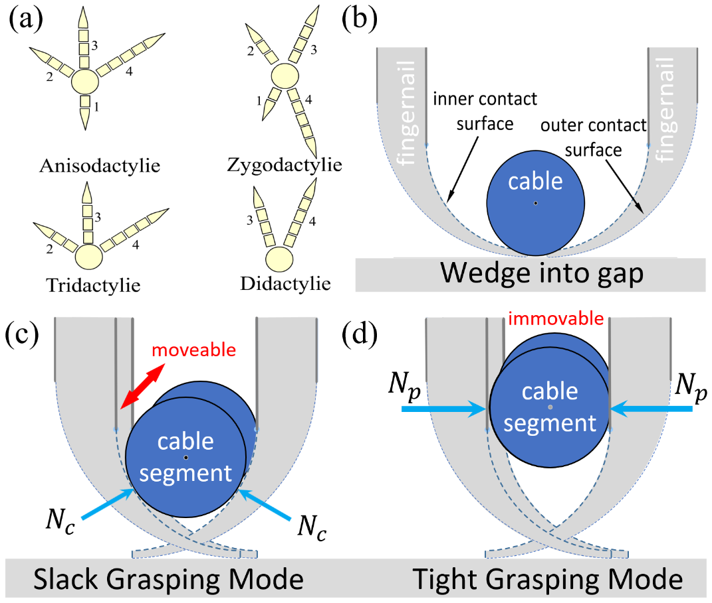
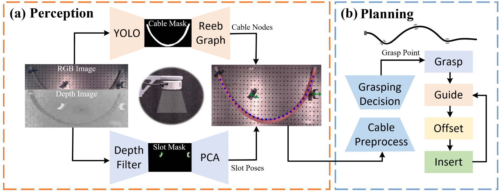

# CaRoBio: 3D Cable Routing with a Bio-inspired Gripper Fingernail 
Jiahui Zuo, Boyang Zhang, Fumin Zhang

FARL Lab, HKUST

### Abstract

The manipulation of deformable linear flexures has a wide range of applications in industry, such as cable routing in automotive manufacturing and textile production. Cable routing, as a complex multi-stage robot manipulation scenario, is a challenging task for robot automation. Common parallel two-finger grippers have the risk of over-squeezing and over-tension when grasping and guiding cables. In this paper, a novel eagle-inspired fingernail is designed and mounted on the gripper fingers, which helps with cable grasping on planar surfaces and in-hand cable guiding operations. Then we present a single-grasp end-to-end 3D cable routing framework utilizing the proposed fingernails, instead of the common pick-and-place strategy. Continuous control is achieved to efficiently manipulate cables through vision-based state estimation of task configurations and offline trajectory planning based on motion primitives. We evaluate the effectiveness of the proposed framework with a variety of cables and channel slots, significantly outperforming the pick-and-place manipulation process under equivalent perceptual conditions. Our reconfigurable task setting and the proposed framework provide a reference for future cable routing manipulations in 3D space.

### Proposed eagle-inspired fingernail

  
  

### Proposed Framework

  

We propose an single-grasp end-to-end framework for 3D cable routing. (a) Our perception model takes in one RGBD image of slots with initial cable to output the task configuration. We use depth filtering and Principle Component Analysis (PCA) to detect the position and orientation of the slots, and YOLOv8 to determine cable segmentation. (b) In planning model, a cable preprocessing step is designed to adjust the cable to a ideal state. With a multi-weight voting strategy, the optimal grasping node is determined. The task configuration (slot positions, orientations and cable nodes) is mapped to a trajectory with four motion primitives. Sequentially, the cable is manipulated with a sequence of parameterized motion primitives iteratively which only grasp once.

### Motion Primitives

  

Parameterized motion primitives. (a) Grasp motion primitive. (b) Offset motion primitive. (c) Insert motion primitive.

### Experiment Results

  

The proposed gripper fingernail is able to grasp a series of everyday DLOs from a planar surface, like USB cables, hoses, and ropes.

  

Experiments demonstrated that this framework performs well (31/35) for cables of medium and large rigidities  with random task configuration.

### Experiments Videos (speed*3)

#### Success grasping with linear objects of different rigidities and diameters 

#### Success Scenarios with cables of different initial states, rigidities and diameters 

#### Failure Cases

Cable folding:

   
Cable misalignment:

The folding and misalignment problems stem from limitations of single-arm operation, which can be solved after applying dual arms.

